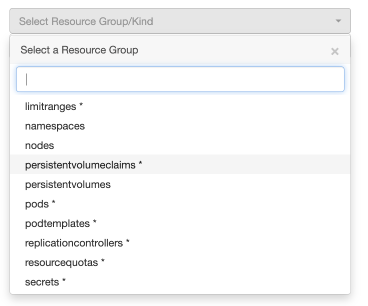
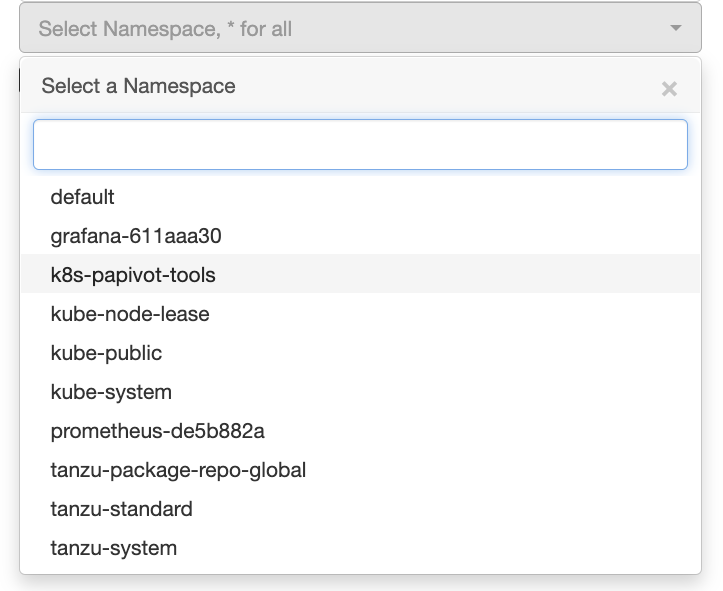
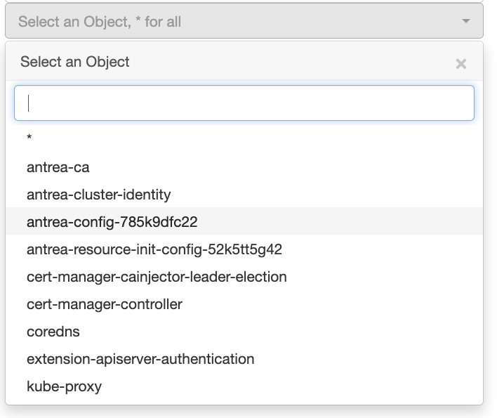
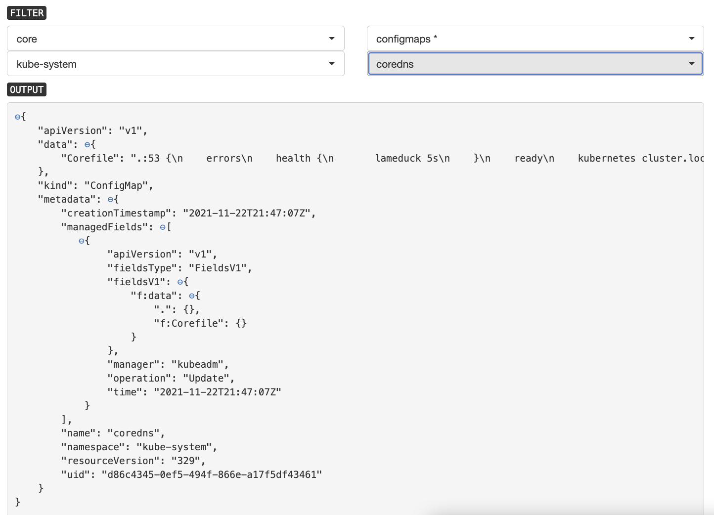

# A Simple Python Flask App to view Kubernetes Objects 

Are you tired of typing `kubectl get ....` ? Want to know what APIs are registered in your Kuberntes cluster? Do you know all the API Resources in your Kuberntes cluster? Want to view all these using a handy browwer UI? Then this is the solution for you !!

Launch it as a standalone app or execute it from a Kubernetes cluster. Access the application from a browser and filter through the various APIs, resources and namespaces to get complete datails of various Kubernetes objects. 

- Main Menu - 
  

Use the provided filters to narrow your search results - 

- Select the API group (including core/v1)
  

- Based on the API group selected, select the resource - 
  

- If Namespaced resource was selected in the previous option, select the relevent namespace -
  

- Select the relavent object to get the details on it - 
  

- Get a detailed JSON output of the relavent object =
  

## Executing as a standalone Python app

- Clone this repository.
- Make sure that Python3 is installed on the host.
- Use `pip3` to install the required dependencies (if not already installed) `pip3 install -r ./requirements.txt`
- A working `KUBECONFIG` file with a valid `context` is accessible.
- Execute the python app - `python app.py`
- Access the app using the browser at `http://IP_ADDRESS_OF_HOST:5000`

## Building a new container image (optional)

- Clone this repository.
- Use the provided Dockerfile as a sample and build a new container image. 
- Upload the image to a registry of your choice

## Deployment on a K8s cluster (preferred method) 

- Use the attached `Dockerfile` to build a new container image or use one already referenced in the sample deployment YAML.
- Use the sample `kubernetes-deployment/deployment.yaml` to deploy the application. Modify the `kubernetes-deployment/deployment.yaml` file as per requirements -
  - Ensure that the `INCLUSTER_CONFIG` env variable is set to 1. 
  - Modify the `image: whoami6443/k8sapiwalkthru:x.y.z` to a valid value if using a custom-built image. 
- Deploy the application - `kubectl apply -f kubernetes-deployment/deployment.yaml`
- Access the application using a browser, using the IP address of the service `k8s-papivot-tools-svc`. 
- The application can also be exposed using a method of your choice - e.g., Istio, Ingress, Gateway, etc. 